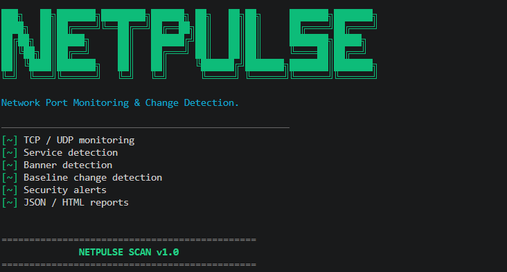
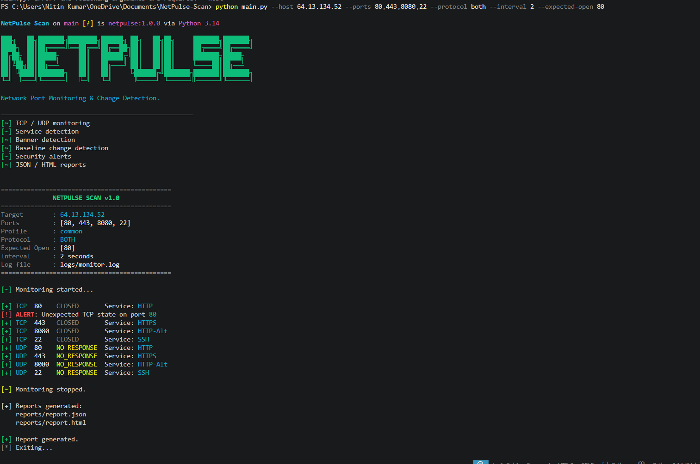
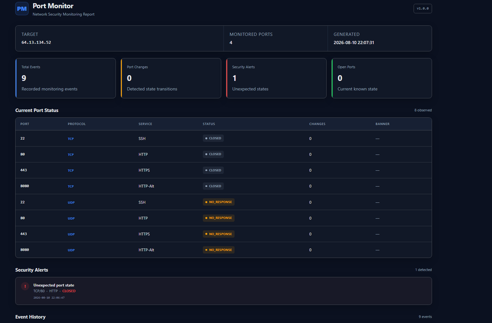

# ⚡ NetPulse Scan

### Network Port Monitoring & Change Detection


> A lightweight Python CLI tool that continuously monitors TCP/UDP ports, detects state changes, identifies services, records events, sends alerts for unexpected TCP states, and generates monitoring reports.

<p align="center">
  
</p>

---

## 🚀 Features

| Feature | Description |
|---|---|
| **TCP Monitoring** | Checks TCP ports and tracks whether they are open or closed. |
| **UDP Monitoring** | Monitors UDP ports and records their observed state. |
| **Port Profiles** | Predefined port groups: `common`, `web`, and `database`. |
| **Custom Ports** | Specify your own ports directly with `--ports`. |
| **Continuous Monitoring** | Rechecks configured ports at a user-defined interval. |
| **Change Detection** | Detects transitions such as `OPEN → CLOSED` and `CLOSED → OPEN`. |
| **Service Detection** | Identifies common services using port mappings and probe results. |
| **Banner Detection** | Attempts to retrieve service banners from open TCP ports. |
| **HTTP Detection** | Retrieves basic HTTP information from supported web ports. |
| **Baseline Monitoring** | Compares TCP states against user-defined expected-open ports. |
| **Security Alerts** | Flags TCP ports that violate the configured baseline. |
| **Desktop Notifications** | Sends native OS notifications for baseline-violation alerts. |
| **Event Logging** | Records monitoring activity and state changes to a log file. |
| **JSON Reports** | Stores monitoring events in structured JSON format. |
| **HTML Reports** | Generates a visual dashboard with port states, events, and statistics. |
| **CLI Interface** | Configure the host, ports, protocol, interval, and baseline from the command line. |
| **Local UDP Testing** | Includes a UDP test server for validating UDP monitoring locally. |
| **No External Services** | Core monitoring runs locally without third-party API calls. |

---

## 🏗️ Architecture

```text
                         ┌─────────────────────┐
                         │    NetPulse Scan    │
                         │       main.py       │
                         └──────────┬──────────┘
                                    │
                         ┌──────────▼──────────┐
                         │   Port Selection    │
                         │ Profiles / Custom   │
                         └──────────┬──────────┘
                                    │
                         ┌──────────▼──────────┐
                         │      Scanner        │
                         │     TCP / UDP       │
                         └──────────┬──────────┘
                                    │
                    ┌───────────────▼───────────────┐
                    │       Service Detection       │
                    │ Service / Banner / HTTP Info  │
                    └───────────────┬───────────────┘
                                    │
                         ┌──────────▼──────────┐
                         │   State Comparison  │
                         │ Previous → Current  │
                         └──────────┬──────────┘
                                    │
                    ┌───────────────┼───────────────┐
                    │               │               │
              ┌─────▼─────┐   ┌────▼─────┐   ┌────▼─────┐
              │  Alerts   │   │   Logs   │   │ Reports  │
              └───────────┘   └──────────┘   └──────────┘
                                                  │
                                           ┌──────▼──────┐
                                           │ JSON / HTML │
                                           └─────────────┘
```

---

## 📁 Project Structure

```text
NetPulse-Scan/
│
├── main.py                 # CLI entry point and monitoring engine
├── scanner.py              # TCP/UDP port checking
├── services.py             # Service, banner and HTTP detection
├── alerts.py               # Desktop notification handling
├── logger.py               # Event logging
├── report.py               # JSON/HTML report generation
├── requirements.txt        # Python dependencies
├── .gitignore              # Ignored runtime/local files
│
├── screenshots/
│   ├── banner.png
│   ├── cli-run.png
│   └── html-report.png
│
└── tests/
    └── udp_server.py       # Local UDP testing utility
```

---

## 📦 Installation

### Requirements

- Python 3.x
- `colorama`
- `plyer`

### Clone

```bash
git clone https://github.com/Nitinkumar-8055/NetPulse-Scan.git
cd NetPulse-Scan
```

### Optional: Create a virtual environment

**Windows:**

```powershell
python -m venv venv
venv\Scripts\activate
```

**Linux/macOS:**

```bash
python3 -m venv venv
source venv/bin/activate
```

### Install dependencies

```bash
pip install -r requirements.txt
```

---

# ⚙️ Configuration

NetPulse Scan is configured through CLI arguments.

| Option | Required | Default | Description |
|---|---|---|---|
| `--host` | Yes | — | Target IP address or hostname. |
| `--ports` | No | Profile ports | Comma-separated ports to monitor. |
| `--profile` | No | `common` | Port profile: `common`, `web`, or `database`. |
| `--protocol` | No | `tcp` | Protocol: `tcp`, `udp`, or `both`. |
| `--interval` | No | `5` | Seconds between monitoring cycles. |
| `--expected-open` | No | None | TCP ports expected to be open. |

### Port priority

If `--ports` is supplied, it overrides the selected profile.

```bash
python main.py --host 127.0.0.1 --profile web --ports 8080
```

The tool monitors only port `8080`.

---

# 🛠️ Usage

## Basic Monitoring

Run with the default `common` profile:

```bash
python main.py --host 127.0.0.1
```

## Custom Ports

```bash
python main.py --host 127.0.0.1 --ports 22,80,443,8080
```

## Web Profile

```bash
python main.py --host 127.0.0.1 --profile web
```

The web profile includes:

```text
80
443
8000
8008
8080
8081
8443
8888
```

## Database Profile

```bash
python main.py --host 127.0.0.1 --profile database
```

The database profile includes:

```text
1433
1521
3306
5432
6379
9042
27017
```

## TCP Monitoring

```bash
python main.py --host 127.0.0.1 --protocol tcp
```

## UDP Monitoring

```bash
python main.py --host 127.0.0.1 --protocol udp
```

## TCP + UDP

```bash
python main.py --host 127.0.0.1 --protocol both
```

## Change Monitoring Interval

The default interval is 5 seconds:

```bash
python main.py --host 127.0.0.1 --interval 2
```

---

# 🎯 Baseline Monitoring

NetPulse Scan can define TCP ports that are expected to be open.

Example:

```bash
python main.py \
  --host 127.0.0.1 \
  --ports 22,80,443 \
  --expected-open 22,80
```

The tool compares the observed TCP state against the configured baseline.

For example:

```text
Expected: OPEN
Observed: CLOSED
```

This can trigger a security alert.

> **Note:** In the current implementation, TCP ports not included in `--expected-open` are treated as expected to be closed.

---

# 🔄 Change Detection

NetPulse Scan stores the previous observed state of each monitored protocol/port pair.

Example:

```text
[+] TCP  8080  OPEN  Service: HTTP
```

If the service stops:

```text
[!] CHANGE DETECTED

Protocol : TCP
Port     : 8080
Service  : HTTP
Status   : OPEN -> CLOSED
```

If it becomes available again:

```text
Status   : CLOSED -> OPEN
```

---

# 🔎 Service & Banner Detection

For open TCP ports, NetPulse Scan attempts to identify services using:

- Common port mappings
- Service banners
- HTTP information

Example:

```text
[+] TCP  8080  OPEN  Service: HTTP
    HTTP   : ...
```

UDP service probing is intentionally limited because generic UDP service identification is less reliable than TCP.

---

# 🚨 Alerts

Unexpected TCP states can trigger desktop notifications through `plyer`.

Alerts are generated when the observed TCP state does not match the configured baseline.

---

# 📝 Logging

Monitoring events are written to the project's logging system.

Runtime logs are stored locally:

```text
logs/
└── monitor.log
```

Generated logs are excluded from Git through `.gitignore`.

---

# 📊 Reports

When monitoring is stopped with:

```text
Ctrl + C
```

NetPulse Scan generates reports containing the monitoring events collected during the session.

Typical output:

```text
reports/
├── report.json
└── report.html
```

The HTML report provides a visual dashboard containing information such as:

- Target
- Monitored ports
- Port states
- Services
- Port changes
- Security alerts
- Monitoring events

Generated reports are runtime artifacts and are excluded from Git.

---

# 🖥️ CLI Preview

<p align="center">
  
</p>

---

# 📊 HTML Report

<p align="center">
  
</p>

---

# 🧪 Testing

A local UDP server is included in:

```text
tests/udp_server.py
```

This can be used to test UDP monitoring on a system you control.

For basic local testing, start a temporary HTTP server:

```bash
python -m http.server 8080
```

Then run:

```bash
python main.py --host 127.0.0.1 --ports 8080
```

NetPulse Scan should observe port `8080` as open.

Stop the HTTP server with:

```text
Ctrl + C
```

NetPulse Scan should then detect the transition:

```text
OPEN -> CLOSED
```

---

# 📋 Command Reference

| Command | Purpose |
|---|---|
| `python main.py --host 127.0.0.1` | Monitor using the default profile |
| `python main.py --host 127.0.0.1 --profile web` | Monitor web ports |
| `python main.py --host 127.0.0.1 --profile database` | Monitor database ports |
| `python main.py --host 127.0.0.1 --ports 8080` | Monitor custom ports |
| `python main.py --host 127.0.0.1 --protocol udp` | Monitor UDP |
| `python main.py --host 127.0.0.1 --protocol both` | Monitor TCP and UDP |
| `python main.py --host 127.0.0.1 --interval 2` | Use a 2-second interval |
| `python main.py --host 127.0.0.1 --expected-open 22,80` | Configure expected TCP ports |

---

# 🔐 Responsible Use

NetPulse Scan is intended for:

- Local development
- Cybersecurity labs
- Systems you own
- Authorized monitoring
- Security education and experimentation

Only monitor hosts and networks where you have explicit permission to perform network checks.

The project is intended for defensive monitoring and learning, not unauthorized reconnaissance.

---

# ⚠️ Current Limitations

- UDP service identification is limited.
- Generic UDP services do not provide reliable service detection.
- Service identification depends on port mappings, banners, and available HTTP information.
- Monitoring state is maintained during the active session.
- Desktop notification behavior depends on operating-system support through `plyer`.
- The current baseline model treats unspecified TCP ports as expected to be closed.

---

# 🗺️ Roadmap

Potential future improvements:

- [ ] Persistent monitoring history
- [ ] Improved service detection
- [ ] More notification backends
- [ ] Enhanced HTML dashboard
- [ ] CSV export
- [ ] Multi-host monitoring
- [ ] CIDR/range monitoring
- [ ] Configuration file support
- [ ] Installable `netpulse` CLI command
- [ ] Automated test suite
- [ ] GitHub Actions CI
- [ ] Versioned releases

---

# 🧰 Technology Stack

**Language**

- Python

**Libraries**

- Colorama
- Plyer

**Core Concepts**

- TCP/UDP networking
- Socket-based monitoring
- Service identification
- Banner detection
- State-change detection
- Baseline monitoring
- Event logging
- Desktop alerting
- JSON/HTML reporting
- CLI argument parsing

---

# 🤝 Contributing

Contributions and improvements are welcome.

For major changes, open an issue first to discuss the proposed feature or modification.

For a pull request:

1. Fork the repository.
2. Create a feature branch.
3. Make your changes.
4. Test the changes locally.
5. Submit a pull request.

---

# 📄 License

This project currently does not include a license.

If you want to distribute NetPulse Scan as an open-source project, add an appropriate `LICENSE` file to the repository.

---

## 👤 Author

**Nitin Kumar**

GitHub: https://github.com/Nitinkumar-8055

---

<p align="center">
  <strong>NetPulse Scan v1.0.0</strong><br>
  Network Port Monitoring & Change Detection
</p>
